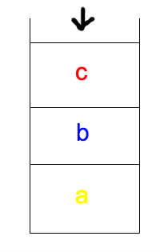



This morning I was curious about how the built-in `sorted()` function works in python. So with the help of Tom, one of the facilitators here at Hacker School, I took my first dive into the python source code.

 
If you’ve heard anything about Timsort, what you probably know is that it takes advantage of partial ordering in the array you’re trying to sort in order to improve performance. Basically, instead of having a one-size-fits-all algorithm, Timsort chooses different approaches based on some stuff about the array it’s given.This is good because real world data is usually not totally random, that is, it usually does have some order or “sortedness” to it already. 

 
What I wanted to know, though, was how does this actually work?

 
I don’t know any C, but handily, within the CPython source code, there is a text file written by Tim Peters, explaining his eponymous function. Here is what I learned.

### 1. If the array that you are trying to sort has fewer than 64 elements, Timsort will simply do a **binary insertion sort**.

   In a normal insertion sort, you would start with the first element of the array and check it against the next item over. If the first item is greater than the second, you flip them, otherwise, you leave them where they are. Now you know your first two items are sorted, so you move on to the third item. You then figure out where the third item belongs by checking from right to left. If item 3 is larger than the preceeding item, you can leave it where it is. Otherwise, you need to check the first item. You continue on down the array until you've placed each item in its proper location.

   <iframe width="560" height="315" src="//www.youtube.com/embed/ROalU379l3U" frameborder="0" allowfullscreen> </iframe>
 
   In the *binary* version, instead of searching through the elements one by one, you perform a binary search to find the appropriate location. This means, you go to the midway point of the array you're searching through, and decide whether your item is greater or smaller. Once you pick a half, then you choose the midpoint of that half and check again. Repeat until you are checking an array of length 2, and you find your spot. Though this method doesn't improve the running time O(n2) of insertion sort, it turns out that comparing two things is much more costly (at least in python?) than swapping, so it improves performance.

### 2. The notion of "**runs**"

   The **run** is a very important concept for Timsort. If you have an array longer    than 64 elements, the algorithm will take a first pass through the array checking    for chunks that are stricty increasing or strictly decreasing (if the chunk is    decreasing, it will be reversed). 
   
   If these chunks are longer than a certain size, known as minrun, which is    determined based on the size of the array,<a href="#fn:1" class="   footnote">1</a> then this is a **natural run**--it occured naturally in your    array. If the chunk is shorter than minrun, you grab `minrun - len(chunk)` items    ahead of your chunk, and perform a **binary insertion sort** to create an    artificial run. 
   
   After this, what you have is an array of sorted chunks of varying lengths. If your    data was totally random, then chunks will probably all be close to the minrun    length. If not, you could have natural runs of wildly varying lengths:
   
   

### 3. Merging

   The next step is to merge sort your sorted chunks. We are only allowed to merge adjacent chunks so that items do not get out of order with respect to the intervening chunks. One important property of Timsort is that it is *stable*,    meaning that items of equal value remain sorted in order with respect to their original positions in the list. (I'll come back to this later).
   
   As Timsort finds runs, it adds them to a stack (so an item seen first in the array goes on first and is at the bottom of the stack).
   
   
   
   Timsort tries to balance two competing needs when merging runs. On the one hand,    we want to put off merging chunks in case it turns out merging our current run    with the next run would be better than (more efficient than) merging with the    previous run. On the other hand, we don't want to let the stack get too big,    because then we'll have to reach really far down to get those earlier items, which    would hinder performance. To enforce a compromise, Timsort keeps track of the    three most recent items on the stack and creates two laws that must hold true of    those items:
   
   >>1. a > b+c
   >>2. b > c 
   
   If either of these laws are broken when a new run is pushed to the stack, items    are merged. If a is larger than c, a and b are merged, otherwise b and c are merged   .
   
### 4. Timrun's merge sort

   Normal merge sort (recall that our runs are already sorted within, so you can skip    to 3:25 in the video):
   
   <iframe width="560" height="315" src="//www.youtube.com/embed/XaqR3G_NVoo"    frameborder="0" allowfullscreen></iframe>
   
   Usually, merging adjacent runs of different lengths _in place_ (remember that    stable thing) is very hard. In order to get around this, Timsort sets aside some    temporary memory, and places the smaller of the two runs (let's call them a and b)    into that temporary space. 
   
   
   
   Or, imagine the line of ladies in white from the video move their line over to    stage left in front of the men. They perform the same operation (or dance)    checking the first item in a (women) against b(men), and the victor fills in the    spaces that a has vacated. (If b is smaller the merge sort has to be performed    backwards, but I won't go into that.)
   
   Actually, what Timsort does is slightly more complicated than this, which brings    me to the last point:
   
### 5. Galloping

   

   So, Timsort is going along merging a and b, and it notices that one run or the    other has been "winning" many times in a row. For a concrete example, imagine if,    in the dancing video, it turned out that all the women had lower numbers than all    the men. All the women would just end up standing back in their original places,    but after doing a lot of extra work. 
   
   Timsort takes advantage of the fact that data often has some preexisting internal    structure, and assumes that if a lot of a's values are lower than b's, then it is    likely that a will continue to have smaller values than b. 
   
   Timsort then enters "galloping mode." Instead of checking the first/leftmost    unsorted values of a and b against one another (i.e. going through one at a time),    Timsort performs a binary search for the appropriate position of b[0] in a[0].    That way, a whole slice of a can be moved back into place. Then it searches for    the appropriate location of a[0] in b, and a whole section of b can be moved at    once. 
   
   It turns out, this operation is not worth it if the appropriate location for b[0]    is very close to the beginning of a (or vice versa), so gallop mode quickly exits    if it isn't paying off. Additionally, Timsort takes note, and makes it harder to    enter gallop mode later by increasing the number of consecutive a-only or b-only    wins required to enter. If gallop mode _is_ paying off, Timsort makes it easier to    reenter. 
   

 
And there you have it, Timsort.

An interesting note: Though Timsort's great performance on arrays with some preexisting internal sorting is its best-known feature, it seems like having a stable sort was one of the main motivators behind adopting timsort. Previously, in order to achieve a stable sort, you'd have to zip the items in your list up with integers, and sort it as an array of tuples. How irritating.

P.S. I know I've glossed over some complexity here, but that aside, if you're reading this and think I've totally misunderstood or mis-explained something, just head on over to my github, and shoot me an email to let me know.

  <ol>
    <li id="fn:1">
      
Minrun is a value between or including 32 to 64 such that len(array) equals or is slightly less than a power of 2. We'll see why this is important later on, but the idea is when you do a merge sort, you want to have a power of two number of things to sort. 
      	

    </li>
  </ol>

 

