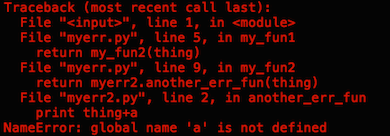
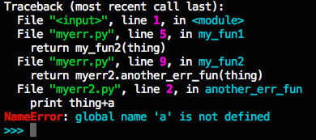

*Update added, Sep 5, see the end of the post* 

Last week, I made my first pull request to an open source project, and it was accepted! The project is called [bpython](http://bpython-interpreter.org/), and it's a "fancy interface to the Python interpreter." If you've ever used ipython, it's kind of like that, but with some nifty other features like in-line syntax highlighting and autocompletion suggestions that pop up as you type (read more about it on the website). You can find bpython on github as well. 

My contribution was a really tiny bug fix (like, one-line-of-code-tiny)--not really something worth writing a whole blog post about. Instead, I want to talk about how you can get started contributing to an open source project, even if you're a rank beginner like me. 

First, pick a project.

I would recommend picking something that you are already using. You'll be motivated to work on it, you'll already know at least a bit about what it does, and you'll be more likely to find bugs to fix in something you're actually using.

bpython was an especially good choice for me because Tom, a facilitator here at Hacker School, is one of the main contributors to the project, and a lot of other Hacker Schoolers have worked on it. 

Which brings me to my second point. If you're not a very experienced programmer like me, and/or have never contributed to an open source project before, it might seem pretty intimidating. Contributing to an existing open source project was one of my main goals for Hacker School, but I was scared to take the plunge. Popping up on IRC and asking for guidance from some contributor seemed like an insurmountable hurdle, and I didn't feel confident getting the dev environment set up by myself. So, talking to someone you know who is already a contributor to a project is a great way to go. I'm very lucky to be at Hacker School where I have easy access to lots of people contributing to various projects, but even if that isn't the case for you, I still think reaching out to one person is less intimidating than reaching out to a whole group on IRC (though other people may feel differently).

Third, get your development environment set up. Clone the github repo with the latest verison of the code base (any project will have instructions on their website about how to do this). For me this also involved setting up a python virtual environment and installing the necessary dependencies. (I also asked Tom a bunch of questions as I went.)

Four, familiarize yourself with the code a bit. Tom walked me through the structure of the project and pointed out important directories and files. 

Five, go to github, click on the issues tab, and look for unresolved bugs. For bpython, this was especially easy because certain bugs have been marked "bitesize"--aka a good place to start if you're new.

I chose one of these "bitesize issues": implementing granular traceback coloring (explanation: When you get an error message, the python interpreter prints the stack trace that lead to the error and the error message itself. Right now bpython just prints this information as a wall of red text, and I am trying to make it helpfully colorful.)

As I was working on implementing this feature, I was using bpython a lot to test what I was working on. As I was doing this, I found another bug that was causing bpython to crash after typing a specific sequence of characters. Tom helped me figure out what was going on, I wrote in something to fix it, and we wrote a test case for it. And voila, a little while later, first pull request to an open source project accepted!

So to sum up, if you want to contribute to an open source project, but you're intimidated, find someone you can bug with lots of questions, get your dev environment set up, find a small bug, fix the small bug. 

The traceback coloring is almost done, so maybe I'll have a second accepted pull request to report soon. 

*Update: second pull request accepted. The latest version of bpython-curtsies now includes my colorful traceback/error messages. See the [pull request on github](https://github.com/bpython/bpython/pull/368).*

Before:

After:

